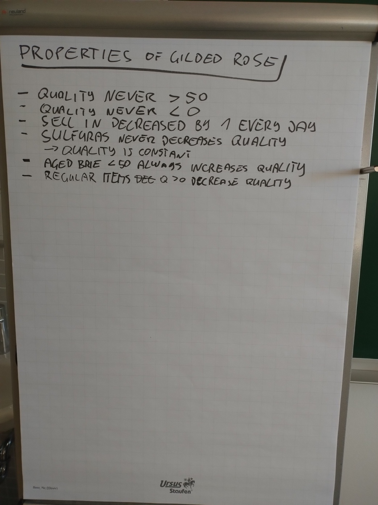

# Property-Based Testing with Gilded Rose

Starting from the [requirements](https://github.com/emilybache/GildedRose-Refactoring-Kata/blob/main/GildedRoseRequirements.md), we identified the following properties (incomplete):

* quality never > 50
* quality never < 0
* sell in decreased by 1 every day
* sulfuras never decreases quality -> quality is constant
* aged brie < 50 always increases quality
* regular items quality > 0 decrease quality

These could be structured to read a bit more like properties (which we talked about, but didn't put on the flipchart): 

* for all items...
  * quality never > 50
  * quality never < 0
  * `sellIn` decreased by 1 every day
* for "Sulfuras"
  * quality never changes
* for "Aged Brie" with quality < 50
  * always increases quality
* for regular items with quality > 0
  * always decrease quality

We used:

* Java
* [jqwik](https://jqwik.net/docs/current/user-guide.html)
* [Gilded Rose codebase](https://github.com/emilybache/GildedRose-Refactoring-Kata/tree/main/Java)
